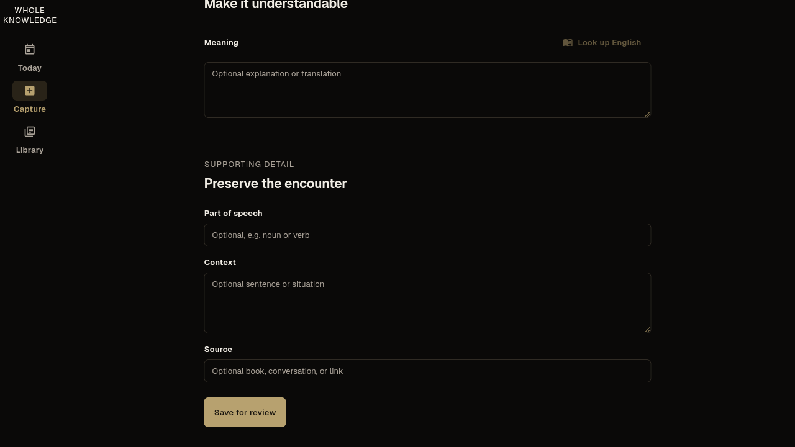
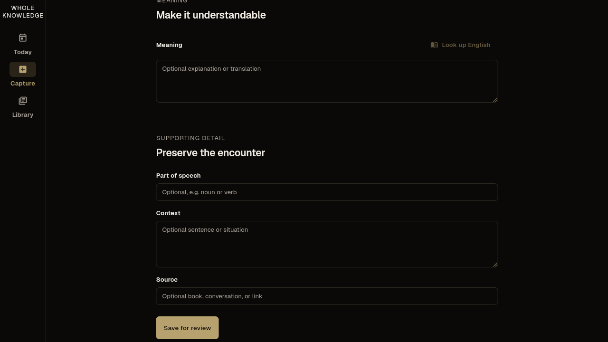
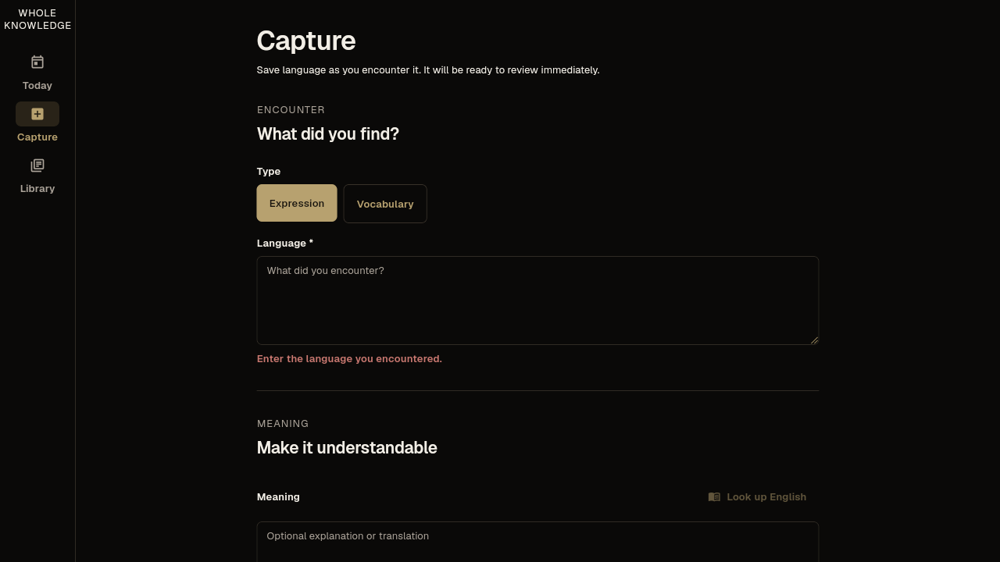
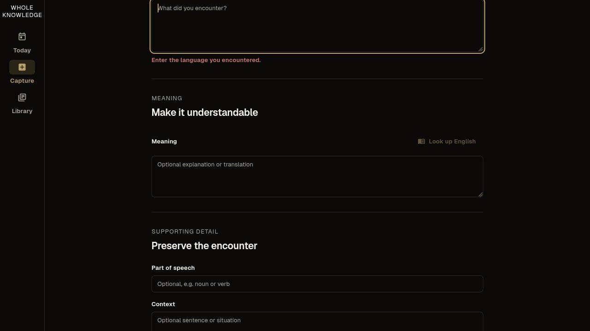

# QA Report: Whole Knowledge Linux

| Field | Value |
|-------|-------|
| **Date** | 2026-08-28 |
| **Target** | `native://linux` |
| **Branch** | `master` |
| **Commit** | `6a1dcb6` |
| **PR** | — |
| **Tier** | Standard |
| **Scope** | Quiet-luxury visual and motion pass: Today, Capture, Library, Review, adaptive navigation |
| **Duration** | 15 minutes |
| **Screens / states visited** | 4 screens / 18 states |
| **Screenshots** | 34 |
| **Framework** | Flutter 3.47.1, Linux desktop |

## Health Score: 100/100

| Category | Baseline | Final |
|----------|----------|-------|
| Runtime / console | 100 | 100 |
| Navigation | 100 | 100 |
| Visual | 100 | 100 |
| Functional | 100 | 100 |
| UX | 92 | 100 |
| Performance | 100 | 100 |
| Content | 100 | 100 |
| Accessibility | 92 | 100 |
| **Weighted total** | **98** | **100** |

## Top Things to Fix

No blocking or deferred product issues remain. ISSUE-001 was fixed and verified during this run.

## Runtime Health

- No Flutter exceptions, Supabase request failures, or application errors appeared during the complete live journey.
- Supabase local and hosted migration histories matched: `20260825220000`, `20260826010000`, and `20260827190000`.
- Linux startup emitted the known environment-only GTK ATK assertion. It had no visible impact on input, rendering, or the completed workflow.
- The live run used an isolated anonymous founder-QA session. Hosted writes went only through the app's repository/RPC flow; no direct database or backend changes were made.

## Coverage

| Area | States and interactions verified |
|------|----------------------------------|
| Today | empty, one item due, completed/caught-up, recent/completed/next context, quick capture |
| Capture | empty form, animated validation, focus reveal, complete form, persisted hosted save |
| Library | empty-detail invitation, selected archive row, wide master-detail, narrow Back, review history |
| Review | Retrieve, Check, Produce, Self-rate, focused textarea, immutable response through rating, completion |
| Navigation | rail, bottom bar, focus mode, 759/761 shell swap, state preservation |
| Responsive | 390×720, 759×720, 761×720, 959×720, 961×720, 1200×800, 1280×720 |
| Motion | loading/content keys, screen/detail crossfades, stage transitions, validation disclosure, hot reload |

Representative evidence:

- [Today, 1200×800](screenshots/quiet-luxury-20260828-final/today-1200x800.png)
- [Capture, wide grouped form](screenshots/quiet-luxury-20260828-final/capture-empty-wide.png)
- [Library, selected wide detail](screenshots/quiet-luxury-20260828-final/library-selected-detail-wide.png)
- [Review, production focus at 390 px](screenshots/quiet-luxury-20260828-final/review-production-390.png)
- [Review history after completion](screenshots/quiet-luxury-20260828-final/library-history-response-390.png)

## Summary

| Severity | Found | Fixed | Deferred |
|----------|-------|-------|----------|
| Critical | 0 | 0 | 0 |
| High | 0 | 0 | 0 |
| Medium | 1 | 1 | 0 |
| Low | 0 | 0 | 0 |
| **Total** | **1** | **1** | **0** |

## Issues

### ISSUE-001: Empty Capture submission leaves validation feedback offscreen

| Field | Value |
|-------|-------|
| **Severity** | medium |
| **Category** | UX / accessibility |
| **Target** | Capture, Linux 1280×720 |
| **Fix Status** | verified |

**Description:** When Capture is scrolled to the terminal Save action, submitting an empty draft adds the required-language error near the top but leaves the viewport at the bottom. The content shifts with no visible explanation, so the user cannot tell why Save did not complete.

**Repro Steps:**

1. Open Capture and scroll to the bottom.
   
2. Press **Save for review** with Language empty.
   
3. Scroll back to the top and observe the required-language error.
   

**Fix:** The presentation layer now focuses the existing Language editor and scrolls it into view after required-content validation fails. The scroll duration respects the centralized reduced-motion policy.

**Before:**

**After:**

## Fixes Applied

| Issue | Status | Commit | Files |
|-------|--------|--------|-------|
| ISSUE-001 | verified live after hot reload | `5b561e8` | `lib/presentation/learning/capture_screen.dart` |

## Regression Tests

| Issue | Test | Commit | Status |
|-------|------|--------|--------|
| ISSUE-001 | `test/capture_validation_visibility_regression_test.dart` | `6a1dcb6` | passed |

## Automated Verification

- `dart format .` — pass, 57 files unchanged.
- `flutter analyze` — pass, no issues.
- `flutter test --reporter compact` — 72 passed, 1 environment-gated integration test skipped.
- `flutter build linux` — pass, release bundle built.
- `flutter build apk --debug` — pass, debug APK built; Gradle emitted only its JVM native-access deprecation warning.
- Android runtime smoke — not run because `flutter devices` reported Linux only and no emulator was available.

## Ship Readiness

| Metric | Value |
|--------|-------|
| Health score | 98 → 100 (+2) |
| Issues found | 1 |
| Fixes applied | 1 verified |
| Deferred product issues | 0 |
| Runtime coverage | Linux complete; Android build complete, runtime unavailable |

**PR Summary:** "QA found 1 medium Capture validation-visibility issue, fixed and verified it, and raised the health score from 98 to 100."
